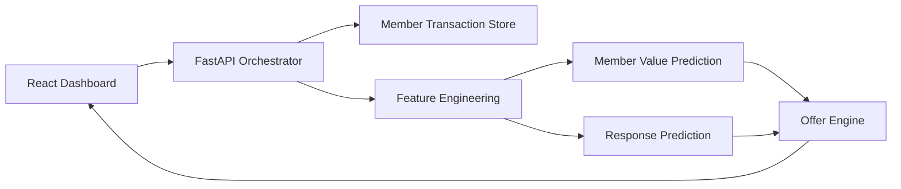

<div align="center">

# Offer Intelligence Platform

### Production-style FastAPI + React system for ML-powered loyalty offer assignment


</div>

---

## Overview

Offer Intelligence Platform is a full-stack portfolio project that demonstrates how a backend service can orchestrate customer data, feature engineering, ML-like predictions, and offer assignment in one reliable API workflow.

The project keeps the original aim: **receive member transaction data, generate prediction signals, and return the best offer.** This revised version adds a working React dashboard, production-style FastAPI structure, JWT-secured demo authentication, typed schemas, tests, Docker support, and CI.

---

## System Flow



---

## What This Demonstrates

<table align="center">
<tr>
<td align="center"><b>Backend</b><br/>FastAPI, typed schemas, async orchestration</td>
<td align="center"><b>ML Systems</b><br/>Feature engineering, scoring, offer decisioning</td>
<td align="center"><b>Frontend</b><br/>React dashboard, forms, charts, API state</td>
</tr>
<tr>
<td align="center"><b>Quality</b><br/>Pytest, Ruff, validation, CI</td>
<td align="center"><b>Deployment</b><br/>Docker, Compose, GitHub Actions</td>
<td align="center"><b>Portfolio Value</b><br/>Clean README, recruiter-friendly structure</td>
</tr>
</table>

---

## Project Structure

```text
offer-intelligence-platform/
├── backend/
│   ├── app/
│   │   ├── api/                  # FastAPI routes
│   │   ├── core/                 # Config, logging, JWT security
│   │   ├── models/               # Domain models
│   │   ├── schemas/              # Request/response schemas
│   │   └── services/             # Store, features, prediction, offer engine
│   └── tests/                    # Backend tests
├── frontend/
│   ├── src/api/                  # API client
│   ├── src/components/           # Reusable UI components
│   ├── src/pages/                # Dashboard
│   └── src/styles/               # CSS
├── scripts/                      # Smoke test, seed data, load test helpers
├── .github/workflows/ci.yml      # Backend/frontend CI
├── docker-compose.yml
├── Dockerfile.backend
├── Dockerfile.frontend
└── .env.example
```

---

## Run Locally

### Backend

```bash
cd backend
python -m venv .venv
source .venv/bin/activate   # Windows: .venv\\Scripts\\activate
pip install -r requirements.txt
uvicorn app.main:app --reload
```

Backend API: `http://localhost:8000`  
Swagger docs: `http://localhost:8000/docs`

### Frontend

```bash
cd frontend
npm install
npm run dev
```

Frontend: `http://localhost:5173`

Demo login:

```text
Username: admin
Password: demo123
```

### Docker Compose

```bash
docker compose up --build
```

---


## Utility Scripts

```bash
python scripts/smoke_test.py
python scripts/seed_member_data.py
python scripts/generate_load.py --requests 100 --concurrency 20
```

Use `./scripts/start-dev.sh` to start the full stack with Docker Compose.

## Auth Flow

The frontend supports both first-time signup and returning-user login. Demo auth uses signed JWTs and can be replaced with OAuth/OIDC token validation in production.

```bash
curl -X POST http://localhost:8000/api/v1/auth/register \
  -H "Content-Type: application/json" \
  -d '{"username":"operator1","password":"demo123"}'

curl -X POST http://localhost:8000/api/v1/auth/login \
  -H "Content-Type: application/json" \
  -d '{"username":"admin","password":"demo123"}'
```

## API Example

Protected endpoints require a Bearer token. First request a local demo JWT:

```bash
TOKEN=$(curl -s -X POST http://localhost:8000/api/v1/auth/login \
  -H "Content-Type: application/json" \
  -d '{"username":"admin","password":"demo123"}' | python -c "import sys,json; print(json.load(sys.stdin)['access_token'])")
```

Then call the offer endpoint:

```bash
curl -X POST http://localhost:8000/api/v1/offers \
  -H "Authorization: Bearer $TOKEN" \
  -H "Content-Type: application/json" \
  -d '{
    "member_id": "A0F18FAA",
    "transaction_type": "GIFT",
    "points_bought": 500,
    "revenue_usd": 25.5
  }'
```

---

## Important Note About ML

This version uses deterministic ML-like scoring so the project runs without external model services. For a more advanced version, the `PredictionService` can be replaced with:

- trained scikit-learn/XGBoost models
- MLflow model registry loading
- SageMaker/Vertex AI endpoints
- batch feature store integration
- real A/B testing logic

---

## Tests

```bash
cd backend
pytest --cov=app --cov-report=term-missing
ruff check app tests
```

---

## Portfolio Positioning

Use this project on GitHub as a **backend + ML systems orchestration project**, not as a deep model-training project.

Recommended one-liner:

> Built a production-style FastAPI and React platform that orchestrates member data, feature engineering, prediction scoring, and loyalty offer assignment with tests, Docker, and CI.
