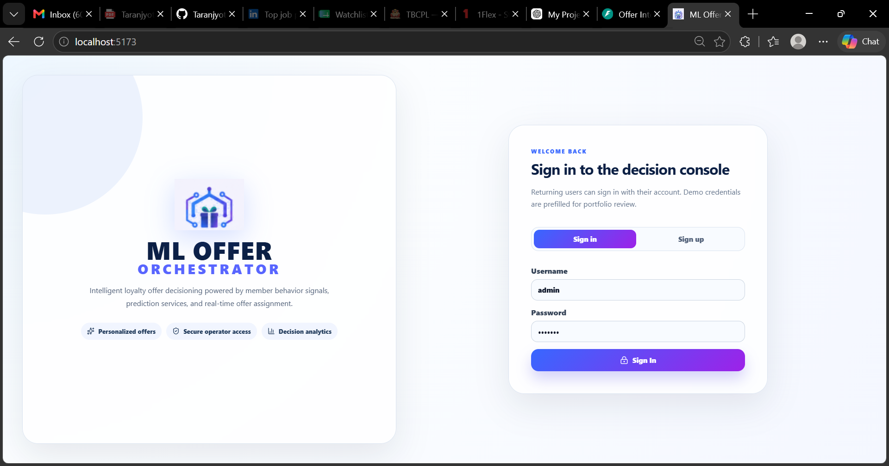
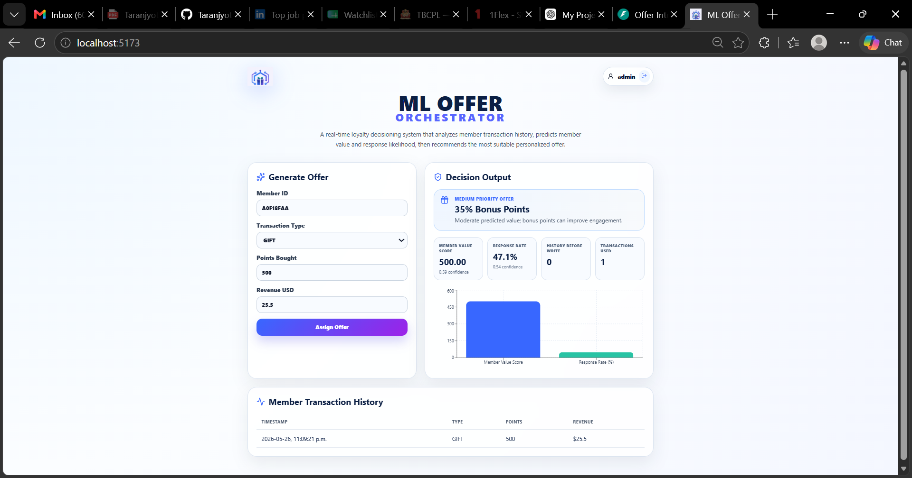
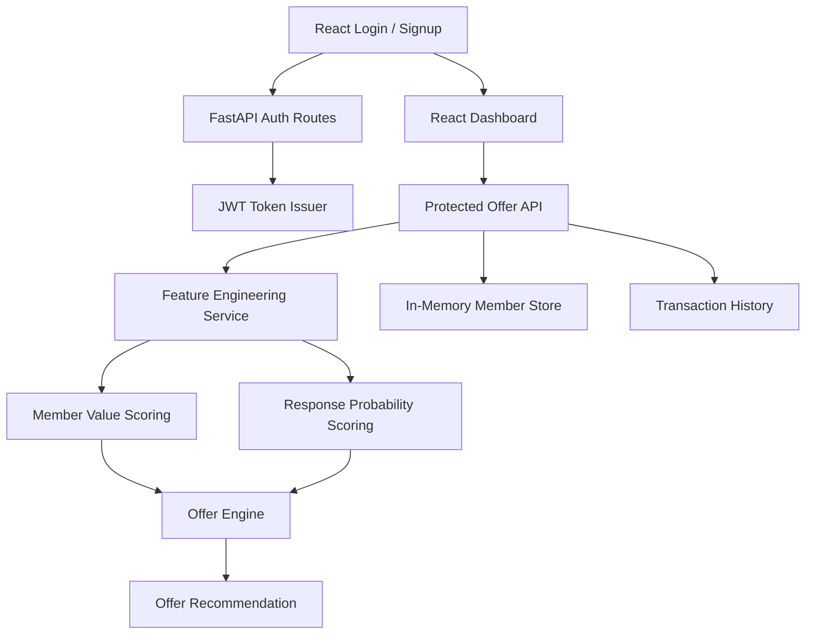

<div align="center">

# 🧠 Offer Intelligence Platform

### Production-ready FastAPI + React platform for ML-inspired loyalty offer decisioning, member behavior scoring, and authenticated offer orchestration.

<p>
  
  
  
</p>

<p>
  
  
  
</p>

<p>
  <a href="#-overview">Overview</a> •
  <a href="#-features">Features</a> •
  <a href="#-screenshots">Screenshots</a> •
  <a href="#-architecture">Architecture</a> •
  <a href="#-quick-start">Quick Start</a> •
  <a href="#-api-reference">API</a> •
  <a href="#-troubleshooting">Troubleshooting</a>
</p>

</div>

---

## 📌 Overview

**Offer Intelligence Platform** is a full-stack decisioning system that evaluates member transactions, generates behavior-based features, runs prediction-style scoring services, and assigns the most suitable loyalty offer through a clean orchestration layer.

It is designed as a **portfolio-grade backend and ML-systems project** that demonstrates FastAPI service design, authenticated APIs, feature engineering, parallel prediction workflows, offer assignment logic, frontend integration, Dockerized deployment, CI checks, tests, and operational scripts.

---

## ✨ Features

<table>
<tr>
<td width="33%" valign="top">

### 🧠 Decisioning

- Member transaction intake
- Behavior feature generation
- Member value scoring
- Response probability scoring
- Offer assignment engine
- Transaction history tracking

</td>
<td width="33%" valign="top">

### 🧩 Platform

- FastAPI backend
- React dashboard
- Sign in / sign up flow
- JWT-secured API boundary
- Protected offer endpoints
- Clean frontend API client

</td>
<td width="33%" valign="top">

### 🚀 Engineering

- Docker support
- GitHub Actions CI
- Pytest backend tests
- Ruff linting
- Operational scripts
- Production-style structure

</td>
</tr>
</table>

---

## 🧱 Tech Stack

<div align="center">

<table>
<tr>
<td align="center" width="25%">
<br/>
<b>Python</b><br/>
Backend
</td>

<td align="center" width="25%">
<br/>
<b>FastAPI</b><br/>
API Layer
</td>

<td align="center" width="25%">
<br/>
<b>React</b><br/>
Frontend
</td>

<td align="center" width="25%">
<br/>
<b>Vite</b><br/>
Build Tool
</td>
</tr>

<tr>
<td align="center">
<br/>
<b>Docker</b><br/>
Containerization
</td>

<td align="center">
<br/>
<b>GitHub Actions</b><br/>
CI/CD
</td>

<td align="center">
<br/>
<b>Pytest</b><br/>
Testing
</td>

<td align="center">
<br/>
<b>Ruff</b><br/>
Code Quality
</td>
</tr>
</table>

</div>

---

## 📸 Screenshots

<p align="center">
  
  
</p>

> Add your current login and dashboard screenshots under `docs/screenshots/` using the filenames above.

---

## 🏗️ Architecture

<div align="center">



</div>

### 🔄 End-to-End Workflow

```text
User Opens Application
        ↓
User Signs Up or Signs In
        ↓
Frontend Stores JWT Access Token
        ↓
User Submits Member Transaction
        ↓
FastAPI Validates Protected Request
        ↓
Feature Engineering Builds Member Behavior Signals
        ↓
Prediction-Style Services Produce Scores
        ↓
Offer Engine Selects the Best Loyalty Offer
        ↓
Transaction and Offer Result Return to Dashboard
        ↓
User Reviews Metrics, Offer Decision, and Recent Activity
```

### System Flow

| Step |                        What Happens                           |
|------|---------------------------------------------------------------|
|  1   | User creates an account or signs in through the frontend      |
|  2   | Backend validates credentials and issues a JWT token          |
|  3   | Dashboard sends protected API requests with the Bearer token  |
|  4   | Transaction details are converted into behavior features      |
|  5   | Member value and response probability scores are generated    |
|  6   | Offer engine assigns the best loyalty offer                   |
|  7   | UI displays decision metrics, charts, and recent transactions |

---

<details>
<summary><strong>📁 Folder Structure</strong></summary>

```text
offer-intelligence-platform/
├── backend/
│   ├── app/
│   │   ├── api/                 # FastAPI route definitions
│   │   ├── core/                # config, security, logging
│   │   ├── models/              # domain models
│   │   ├── schemas/             # request/response schemas
│   │   └── services/            # orchestration, scoring, users
│   ├── tests/                   # pytest test suite
│   ├── requirements.txt
│   └── pyproject.toml
├── frontend/
│   ├── public/                  # logo and favicon assets
│   ├── src/
│   │   ├── api/                 # authenticated API client
│   │   ├── components/          # reusable UI components
│   │   ├── pages/               # login and dashboard views
│   │   └── styles/              # global CSS
│   ├── package.json
│   └── vite.config.js
├── scripts/                     # smoke test, seed data, load test
├── .github/workflows/ci.yml
├── docker-compose.yml
├── Dockerfile.backend
├── Dockerfile.frontend
├── .env.example
├── LICENSE
└── README.md
```

</details>

---

## ⚡ Quick Start

### Prerequisites

| Requirement |       Version      |
|-------------|--------------------|
|   Python    |       3.11+        |
|   Node.js   |       20+          |
|   Docker    |     Optional       |
|    Git      | Any recent version |

### Run Backend Locally

```bash
cd backend
python -m venv .venv
source .venv/bin/activate  # Windows: .venv\Scripts\activate
pip install -r requirements.txt
uvicorn app.main:app --reload --port 8000
```

Open:

```text
http://localhost:8000/docs
```

### Run Frontend Locally

```bash
cd frontend
npm install
npm run dev
```

Open:

```text
http://localhost:5173
```

### Run Tests

```bash
cd backend
pytest -q
ruff check app tests
```

### Run with Docker

```bash
docker compose up --build
```

Open:

```text
Frontend: http://localhost:5173
Backend:  http://localhost:8000/docs
```

---

## 🔐 Authentication

The application includes a JWT-secured authentication boundary with registration, login, and protected offer APIs.

|      Area      |                         Implementation                       |
|----------------|--------------------------------------------------------------|
| Sign up        | `/auth/register` creates a demo user                         |
| Sign in        | `/auth/login` verifies credentials                           |
| Session        | Frontend stores token client-side                            |
| Protected APIs | Offer routes require `Authorization: Bearer <token>`         |
| Future-ready   | Boundary can be replaced with OAuth/OIDC provider validation |

### Production Auth Upgrade Path

|         Current        |                         Production Upgrade                             |
|------------------------|------------------------------------------------------------------------|
| In-memory demo users   | PostgreSQL users table or managed identity provider                    |
| Local JWT signing      | OAuth/OIDC token validation through Auth0, Cognito, Azure AD, or Clerk |
| Demo password hashing  | Strong password policy, MFA, reset flow, account verification          |
| Frontend token storage | Secure cookie/session strategy depending on deployment model           |

---

## 🔌 API Reference

### Register User

```bash
curl -X POST http://localhost:8000/auth/register \
  -H "Content-Type: application/json" \
  -d '{"username":"demo","password":"demo123"}'
```

### Login

```bash
curl -X POST http://localhost:8000/auth/login \
  -H "Content-Type: application/json" \
  -d '{"username":"demo","password":"demo123"}'
```

### Get Current User

```bash
curl http://localhost:8000/auth/me \
  -H "Authorization: Bearer <access_token>"
```

### Create Offer Decision

```bash
curl -X POST http://localhost:8000/member/offer \
  -H "Content-Type: application/json" \
  -H "Authorization: Bearer <access_token>" \
  -d '{
    "memberId": "A0F18FAA",
    "lastTransactionType": "GIFT",
    "lastTransactionPointsBought": 500,
    "lastTransactionRevenueUsd": 2.5
  }'
```

### Read Offer History

```bash
curl http://localhost:8000/member/history \
  -H "Authorization: Bearer <access_token>"
```

---

## 🧪 Operational Scripts

|            Script             |                   Purpose                   |
|-------------------------------|---------------------------------------------|
| `scripts/start-dev.sh`        | Starts the local development flow           |
| `scripts/smoke_test.py`       | Validates auth and offer API behavior       |
| `scripts/seed_member_data.py` | Sends sample transactions to the backend    |
| `scripts/generate_load.py`    | Runs a lightweight concurrent API load test |

Example:

```bash
python scripts/smoke_test.py
python scripts/seed_member_data.py
python scripts/generate_load.py
```

---

## 🧪 What This Project Demonstrates

|       Skill Area       |                       Demonstrated Through                           |
|------------------------|----------------------------------------------------------------------|
| Backend Engineering    | FastAPI routes, schemas, services, validation, dependency boundaries |
| ML Systems Thinking    | Feature engineering, scoring services, offer decision workflow       |
| Full-Stack Development | React dashboard connected to protected backend APIs                  |
| Authentication         | Register/login flow, JWT token handling, protected routes            |
| DevOps                 | Docker, Docker Compose, GitHub Actions CI                            |
| Testing                | Pytest coverage for auth and offer flow behavior                     |
| Code Quality           | Ruff linting, clean folders, operational scripts                     |
| Product Thinking       | Polished UI, clear dashboard metrics, user-friendly errors           |

---

## 🧰 Troubleshooting

<details>
<summary><strong>Frontend cannot connect to backend</strong></summary>

Confirm the backend is running:

```bash
curl http://localhost:8000/health
```

Then confirm `frontend/.env.example` or your local `.env` points to:

```text
VITE_API_BASE_URL=http://localhost:8000
```

Restart the frontend after changing environment variables.

</details>

<details>
<summary><strong>401 Unauthorized when submitting an offer</strong></summary>

This means the request is missing a valid Bearer token.

Sign in again through the UI, or call `/auth/login` and pass the returned token:

```text
Authorization: Bearer <access_token>
```

</details>

<details>
<summary><strong>Port already in use</strong></summary>

Stop the existing process or run on a different port:

```bash
uvicorn app.main:app --reload --port 8001
npm run dev -- --port 5174
```

</details>

<details>
<summary><strong>Node/Vite dependency issues</strong></summary>

Use Node 20+ and reinstall dependencies:

```bash
cd frontend
rm -rf node_modules package-lock.json
npm install
npm run build
```

</details>

<details>
<summary><strong>Python dependency issues</strong></summary>

Recreate the virtual environment:

```bash
cd backend
rm -rf .venv
python -m venv .venv
source .venv/bin/activate
pip install -r requirements.txt
pytest -q
```

</details>

---

## 🔄 Recommended Clean Rebuild

```bash
# Backend
cd backend
python -m venv .venv
source .venv/bin/activate
pip install -r requirements.txt
ruff check app tests
pytest -q

# Frontend
cd ../frontend
npm install
npm run build

# Full stack
cd ..
docker compose up --build
```

---

## 🗺️ Roadmap

| Priority |                     Improvement                     |
|----------|-----------------------------------------------------|
|   High   | Replace demo user store with PostgreSQL persistence |
|   High   | Add OAuth/OIDC provider integration                 |
|   High   | Persist offer decisions and member events           |
|  Medium  | Add real trained ML model or model-serving endpoint |
|  Medium  | Add observability with structured logs and metrics  |
|  Medium  | Add Redis cache for member features                 |
|  Medium  | Add role-based access control                       |
|   Low    | Add Kubernetes manifests                            |
|   Low    | Add cloud deployment templates                      |
|   Low    | Add analytics dashboard for offer performance       |

---

## 📄 License

This project is licensed under the [MIT License](LICENSE).

---

## ⚠️ Disclaimer

This project is intended for educational, portfolio, and system design demonstration purposes.

The scoring logic included in this repository simulates ML-style offer decisioning. For real production use, connect the orchestration boundary to validated models, persistent storage, monitoring, and enterprise-grade identity management.
